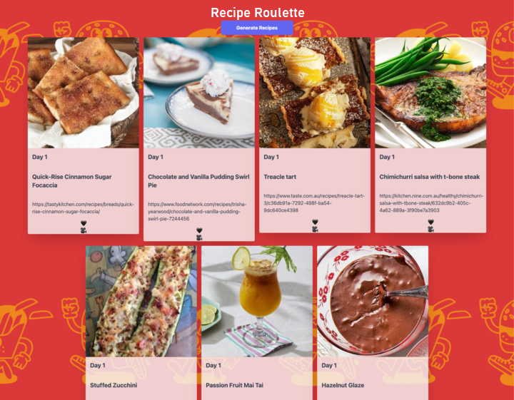

# Recipe Roulette
An app to randomly generate weekly recipes.

## Image of our Website
 

## Link to deployed application
https://ricardoshade.github.io/FrugalChef/

## Description
Our application allows its users to plan a week's worth of recipes by randomly retrieving recipes online.

## Usage
Always wondering "What's for Dinner tonight?"  Our app is the answer to that very question!  Users can use 'Recipe Roulette' to randomly retrieve as many different recipes online as they need.  It allows users to choose from new and interesting dishes that they may have never seen or heard of before.

## License
Our application is currently licensed under the MIT License.
